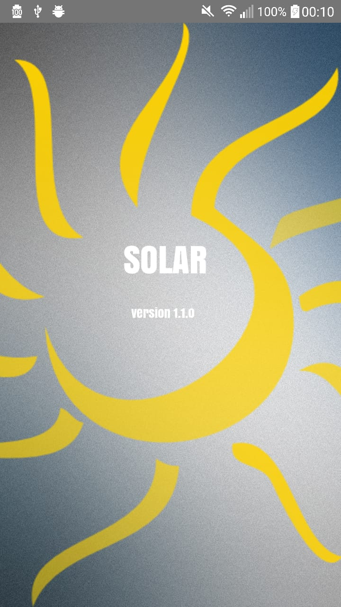
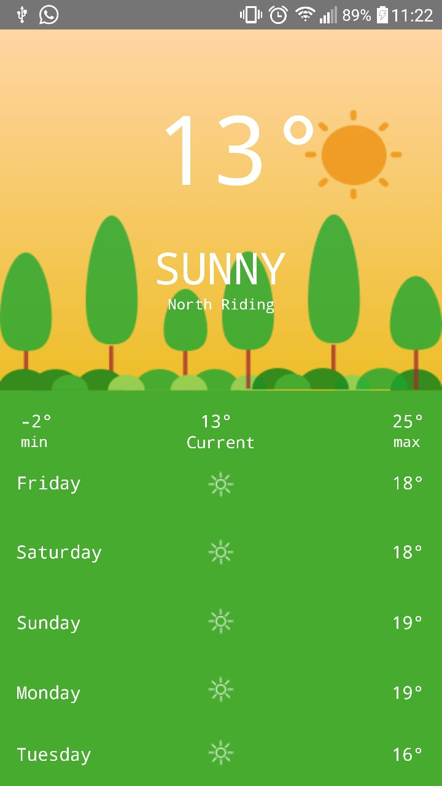

# Weather-App

- Android based weather application using the OpenWeatherMapAPI to fetch and display the current weather conditions as well a 5 day forcast, using the current location the user is in.

# How to use

- The user will open the application and if already not granted, the application will ask for location access as well as a current       -  internet connection.
- The application will then collect the uses current location and make an API call to retrieve the weather details.
- Finally tbe application will display the current weather and 5 day forcast to the user using the information gathered.

-

